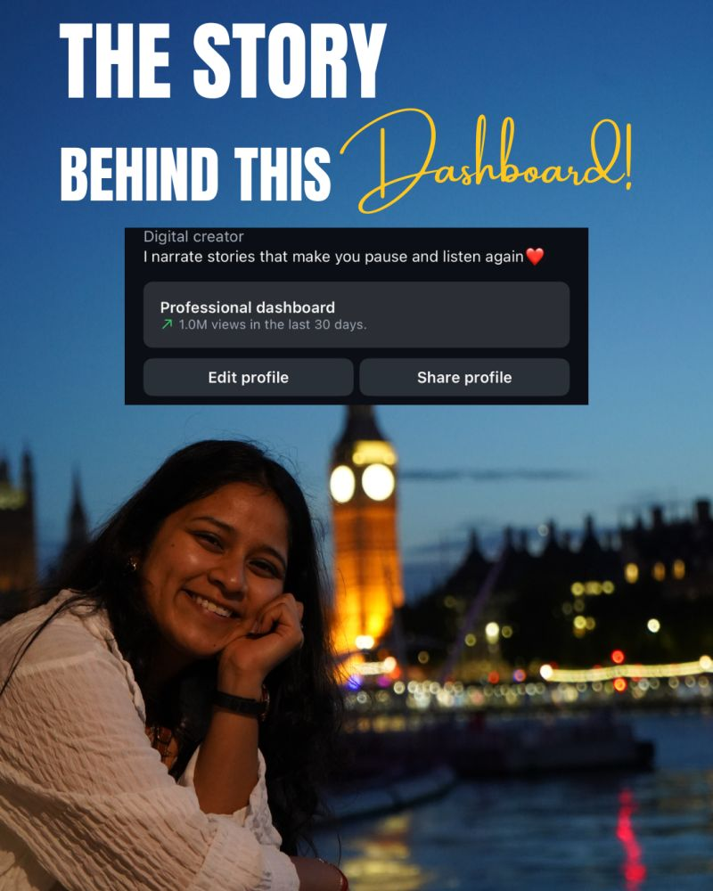

<h1>
  
  What the Plot
</h1>

<h3>An independent Instagram storytelling and audience growth project</h3>

I’ve always been drawn to storytelling. Growing up, I loved how the way a story is narrated can completely change whether someone stops, listens and remembers it.

As a marketer, I wanted to test that instinct somewhere the audience response was immediate. I wanted to understand what happens when **storytelling, curiosity, audience behaviour and content performance** meet in the real world.

That is what led me to start **What the Plot** in **November 2025**, an independent Instagram creator channel built around stories, timelines and narratives I genuinely wanted to tell.

Along the way, it became my own live environment for understanding **what makes people stop, watch, engage and share**.

🔗 **[Explore What the Plot on Instagram](https://www.instagram.com/what.the.plot_/)**

---

## 📊 1M+ organic views in 30 days

   
  <em>Instagram Professional Dashboard showing 1M+ organic views in 30 days.</em>

---

## 📈 The channel so far

📱 **50+ pieces of content published** 
🚀 **45+ posts have crossed 10K views** 
👀 Individual content has reached between **10K and 1.1M+ views** 
📊 **1M+ organic views recorded within a 30-day period** 
🎣 Tested different **hooks, narratives, formats and storytelling approaches** to understand what resonates with the audience

For me, the interesting part was never simply whether a Reel performed well.

It was understanding **why people responded to it** and what I could carry into the next story.

---

## 🎬 Storytelling meets audience behaviour

Running the channel gave me a space to test the creative side of marketing directly with a real audience.

🎣 **Which opening makes someone stop?** 
📖 **Which story keeps them interested?** 
👥 **What actually resonates with the audience?** 
🔁 **What makes someone share something with another person?** 
📈 **What can performance tell me about what to create next?**

Rather than treating every post as an isolated piece of content, I started looking at patterns across them and using those signals to shape what I tested next.

---

## 📊 Following the performance

I use Instagram's **Professional Dashboard and content analytics** to understand how the channel develops across reach, views, engagement and individual content performance.

That creates a simple feedback loop:

**Story idea → Hook → Content → Audience response → Performance → Next experiment**

The numbers help me understand the performance.

The audience response helps me understand the story.

---

## 🤝 Collaborations

As the audience grew, What the Plot also created opportunities beyond my own content.

I have worked across **paid partnerships, education collaborations, consumer brands and independent businesses**, including collaborations with **Uber**, education-focused work with **QS in India**, and partnerships with independent brands and vendors.

These opportunities gave me another side of the creator experience: taking a partner objective or brief and turning it into content that still needs to feel **natural, relevant and worth watching for the audience**.

---

## 💭 Why it's part of my portfolio

Most of my professional experience sits across **campaigns, growth, demand generation, CRM, lifecycle and marketing technology**.

What the Plot represents another side of how I work as a marketer:

**Storytelling → Audience understanding → Creative testing → Performance → Iteration**

It shows the part of marketing that cannot always be understood from a dashboard alone: **what makes something resonate with real people**.

Sometimes, the quickest way to understand an audience is to create something, put it in front of them and see what they do with it.

---

## 👋 If you like stories too

If you're someone who enjoys **storytelling, hooks, content creation or simply understanding why certain stories stay with people**, you might enjoy exploring What the Plot.

It is where I test ideas, play with different ways of telling a story and learn directly from how people respond to them.

🎬 **[Explore What the Plot on Instagram](https://www.instagram.com/what.the.plot_/)**

💬 **[Connect with me on LinkedIn](https://www.linkedin.com/in/roobalgupta11/)**
